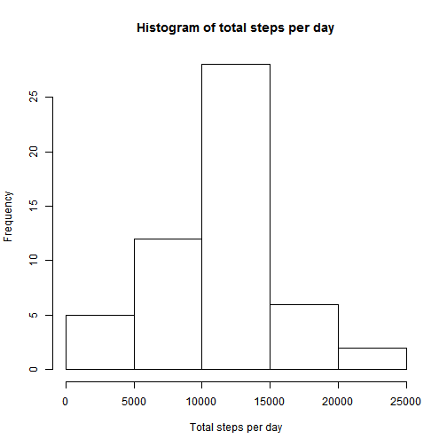
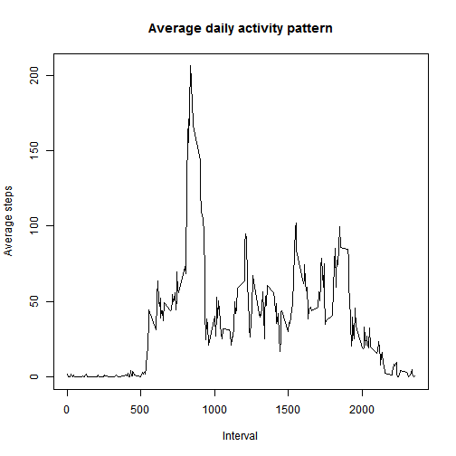
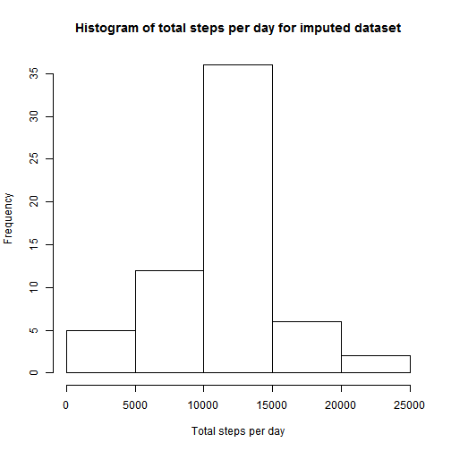
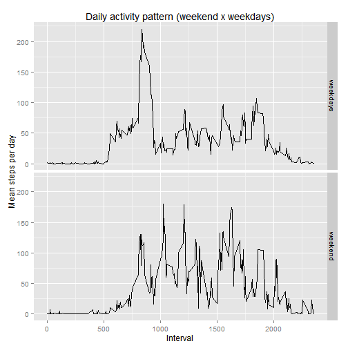

-----------------------------------------------------------------------------------------------

## Loading and preprocessing the data

```r
library(Hmisc)
```

```
## Warning: package 'Hmisc' was built under R version 3.2.2
```

```
## Loading required package: grid
## Loading required package: lattice
```

```
## Warning: package 'lattice' was built under R version 3.2.2
```

```
## Loading required package: survival
```

```
## Warning: package 'survival' was built under R version 3.2.2
```

```
## Loading required package: Formula
```

```
## Warning: package 'Formula' was built under R version 3.2.2
```

```
## Loading required package: ggplot2
```

```
## Warning: package 'ggplot2' was built under R version 3.2.2
```

```
## 
## Attaching package: 'Hmisc'
## 
## The following objects are masked from 'package:base':
## 
##     format.pval, round.POSIXt, trunc.POSIXt, units
```

```r
library(ggplot2)
library(dplyr)
```

```
## Warning: package 'dplyr' was built under R version 3.2.2
```

```
## 
## Attaching package: 'dplyr'
## 
## The following objects are masked from 'package:Hmisc':
## 
##     combine, src, summarize
## 
## The following objects are masked from 'package:stats':
## 
##     filter, lag
## 
## The following objects are masked from 'package:base':
## 
##     intersect, setdiff, setequal, union
```

```r
options(scipen=999)

directory <- "C:/RAWDATA/RMD1/RepData_PeerAssessment1"
setwd(directory)
stepsdf_orig<- read.csv("activity/activity.csv"
                      ,colClasses = c("numeric","Date","numeric")
                      ,stringsAsFactors = FALSE)
## remove NAs
stepsdf     <- filter(stepsdf_orig, is.na(steps)==FALSE)

## calculate mean and median
totalSteps  <- stepsdf %>%  group_by(date) %>% summarize(steps_per_day=sum(steps))
meanSteps   <- mean(totalSteps$steps_per_day)
medianSteps <- median(totalSteps$steps_per_day)
```

-----------------------------------------------------------------------------------------------

## What is mean total number of steps taken per day?

### The mean total steps taken each day were 10766.19

### The median total steps taken each day were 10765


```r
hist(totalSteps$steps_per_day
    ,xlab="Total steps per day"
    ,main="Histogram of total steps per day" )
```

 


-----------------------------------------------------------------------------------------------

## What is the average daily activity pattern?

```r
dailyPattern   <- stepsdf %>%  group_by(interval) %>% summarize(steps_per_interval=mean(steps))

plot(dailyPattern$interval
    ,dailyPattern$steps_per_interval
    ,xlab="Interval"
    ,ylab="Average steps"
    ,main="Average daily activity pattern"
    ,type="n") ## wait to plot, clear plot)

lines(dailyPattern$interval
     ,dailyPattern$steps_per_interval
     ,lwd=1)
```

 

-----------------------------------------------------------------------------------------------

## Imputing missing values

```r
# calculates total NAs
totalNAs <- sum(is.na(stepsdf_orig$steps))

# loop to fill in NAs with averages from daily pattern
for (i in 1:nrow(stepsdf_orig)){
    
    if (is.na(stepsdf_orig$steps[i])){
        stepsdf_orig$steps[i] <- dailyPattern$steps_per_interval[dailyPattern$interval==stepsdf_orig$interval[i]] 
        }
}

total2Steps  <- stepsdf_orig %>%  group_by(date) %>% summarize(steps_per_day=sum(steps))

mean2Steps   <- mean(total2Steps$steps_per_day)
median2Steps <- median(total2Steps$steps_per_day)

diffMeanSteps   <- mean2Steps   - meanSteps
diffMedianSteps <- median2Steps - medianSteps
```

### The mean total steps taken each day with filled dataset were 10766.19

### The median total steps taken each day with filled dataset were 10766.19


```r
hist(total2Steps$steps_per_day
    ,xlab="Total steps per day"
    ,main="Histogram of total steps per day for imputed dataset" )
```

 

## Do these values differ from the estimates from the first part of the assignment? 

### The values differ in 0 for the means and 1.1886792 for the median

-----------------------------------------------------------------------------------------------

## What is the impact of imputing missing data on the estimates of the total daily number of steps?

### Although the difference is inexistent for the means, and is very small for the median, daily total step values concentrated more around the 10000-15000 range 

-----------------------------------------------------------------------------------------------

## Are there differences in activity patterns between weekdays and weekends?


```r
labs<-c("weekdays","weekend")

stepsdf_orig <- mutate(stepsdf_orig
                      ,weekend=cut(ifelse(as.POSIXlt(stepsdf_orig$date)$wday==0 ## transforms sunday to 7
                                         ,7                                     ## to make it easier to
                                         ,as.POSIXlt(stepsdf_orig$date)$wday)   ## break
                                   ,breaks=c(0,6,8)
                                   ,labels = labs
                                   )
                      )

dailyPatternWeek <- stepsdf_orig %>%  group_by(weekend,interval) %>% summarize(steps_per_day=mean(steps))
p <- ggplot(dailyPatternWeek,aes(interval,steps_per_day))
p <- p + geom_line()
p <- p + facet_grid(weekend~.)
p <- p + xlab("Interval") + ylab("Mean steps per day")
p <- p + labs(title="Daily activity pattern (weekend x weekdays)") 
print(p)
```

 

### It is possible too see the pattern is quite different in weekdays and weekends. 
### In weekdays the pattern shows that activity starts earlier and reaches a strong peak before noon.
### In weekends activity starts later, and there are peaks distributed more or less evenly through the  morning and the afternoon.


